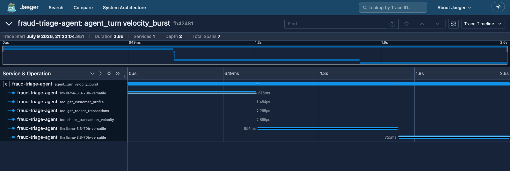

# agentobs — Observability for LLM Agent Loops

OpenTelemetry instrumentation for agentic AI applications: **spans per agent
turn, tool call, and LLM request**, with token usage and **USD cost
attribution** on every model call. Attribute names follow the OTel GenAI
semantic conventions (`gen_ai.*`), so traces work in any OTLP backend
(Jaeger, Grafana Tempo, Datadog, Honeycomb).

A live trace of the [fraud-triage-agent](https://github.com/arunkonapala/fraud-triage-agent)
investigating a stolen-card velocity burst (LangGraph on Groq), rendered in Jaeger:



One `agent_turn` root span → three LLM calls interleaved with three ledger
tool calls. Each `llm` span carries `gen_ai.usage.input_tokens` /
`output_tokens` and `agentobs.cost.usd`.

## Why

Agent loops are opaque: a single user turn can fan out into many model
requests and tool executions, and the bill arrives with no attribution.
This layer answers *what did the agent actually do, how long did each step
take, and what did it cost* — per turn, per tool, per model call.

## Install

```bash
pip install "agentobs[langchain] @ git+https://github.com/arunkonapala/agent-observability"
```

## Usage

### LangChain / LangGraph — zero code changes

```python
from agentobs import init_tracing
from agentobs.integrations.langchain import OTelCallbackHandler

init_tracing("my-agent", exporter="otlp")   # or AGENTOBS_EXPORTER=otlp
graph.invoke(state, config={"callbacks": [OTelCallbackHandler()]})
```

### Manual agent loops (raw Anthropic/OpenAI SDK)

```python
from agentobs import agent_turn, llm_call, record_llm_usage, tool_call, init_tracing

init_tracing("finance-copilot", exporter="otlp")

with agent_turn("chat", session_id=session_id):
    with llm_call("claude-opus-4-8") as span:
        response = client.messages.create(...)
        record_llm_usage(span, "claude-opus-4-8",
                         response.usage.input_tokens,
                         response.usage.output_tokens,
                         cache_read_tokens=response.usage.cache_read_input_tokens)
    with tool_call("get_budget"):
        result = execute_tool(...)
```

### Exporters

| `AGENTOBS_EXPORTER` | Destination |
|---|---|
| `none` (default) | No-op — zero overhead in production until enabled |
| `console` | Spans printed to stdout |
| `otlp` | OTLP/HTTP to `AGENTOBS_OTLP_ENDPOINT` (default `http://localhost:4318`) |
| `memory` | In-memory, for tests |

### Cost attribution

Built-in pricing for current Anthropic and Groq models (cache-aware:
reads at 10%, writes at 1.25× input price). Unknown models get token
counts but no cost attribute. Extend at runtime:

```python
from agentobs import register_pricing
register_pricing("my-fine-tune", input_per_mtok=1.0, output_per_mtok=2.0)
```

## Reproduce the trace above (no Docker needed)

```bash
# 1. Jaeger standalone binary
tar xzf jaeger-2.19.0-darwin-arm64.tar.gz && ./jaeger

# 2. Run an instrumented agent
cd fraud-triage-agent
AGENTOBS_EXPORTER=otlp python demo.py

# 3. Open http://localhost:16686 → service "fraud-triage-agent"
```

## Integrations in the wild

| App | Adapter | What's traced |
|---|---|---|
| [fraud-triage-agent](https://github.com/arunkonapala/fraud-triage-agent) | LangChain callback | LangGraph pipeline: turn → investigator LLM calls → ledger tools |
| [finance-copilot](https://github.com/arunkonapala/finance-copilot) | span helpers | Manual streaming tool-use loop: turn → Claude rounds (cache-aware cost) → finance tools |

## Tests

```bash
pip install -e ".[dev]" && pytest tests/ -v   # 12 tests, in-memory exporter
```

## Tech stack

OpenTelemetry SDK · OTel GenAI semantic conventions · LangChain callbacks · pytest
